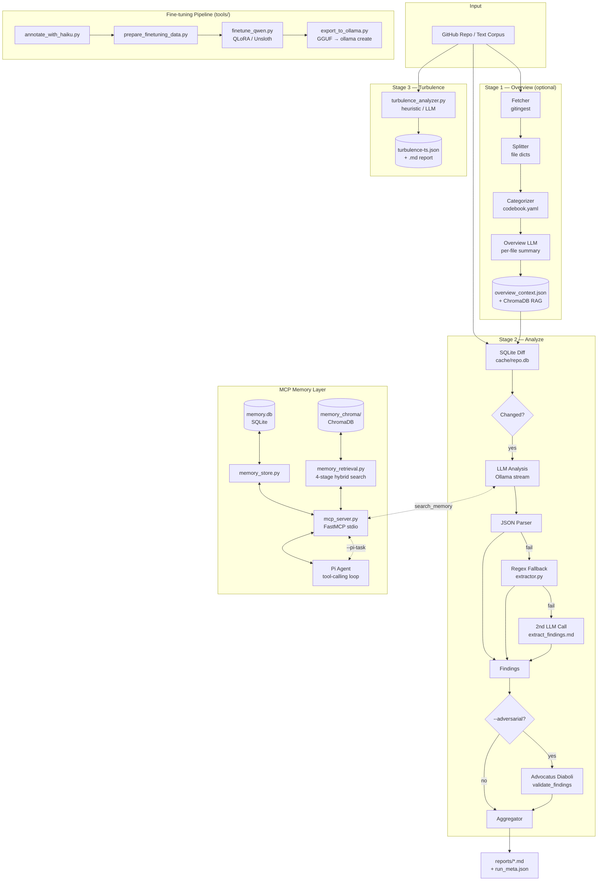

# MayringCoder

> Local, offline-first AI analysis for GitHub repositories and text corpora — powered by [Ollama](https://ollama.com).

[](https://www.python.org/)
[](LICENSE)
[](https://ollama.com)
[]()

MayringCoder applies **Mayring's qualitative content analysis** methodology to software repositories and text documents. It fetches a repository, categorizes every file, and runs a local LLM analysis — producing a structured Markdown report with findings, severity scores, and fix suggestions.

No cloud API keys required. Everything runs locally.

---

## What it does

Two primary use cases share one pipeline:

| Mode | Purpose | Codebook | Prompt |
|---|---|---|---|
| **Code Review** | Code smells, security, architecture | `codebook.yaml` | `prompts/file_inspector.md` |
| **Social Research** | Qualitative content analysis (Mayring) | `codebook_sozialforschung.yaml` | `prompts/mayring_deduktiv.md` / `mayring_induktiv.md` |

---

## Architecture



---

## Features

- **Fully local** — no cloud dependency, runs via Ollama
- **Incremental analysis** — SQLite snapshot diff; only changed files are re-analyzed
- **Automatic file categorization** — YAML codebook assigns Mayring categories and risk priority
- **Two-stage extraction** — JSON parse → regex fallback → second LLM call
- **Adversarial validation** — `--adversarial` runs a second LLM pass (Advocatus Diaboli) to reject false positives
- **Overview mode** — per-file summaries cached to JSON + ChromaDB for RAG context
- **Turbulence analysis** — detects files with mixed responsibilities and hot zones
- **MCP Memory Layer** — persistent, hybrid-retrieval memory (SQLite + ChromaDB) via FastMCP stdio
- **Pi Agent** — tool-calling loop with `search_memory` access; supports both file review and free-form tasks
- **Fine-tuning pipeline** — annotate → QLoRA train → GGUF export → `ollama create`
- **Vision captioning** — image ingestion via `qwen2.5vl` for multimodal repos
- **GPU monitoring** — nvidia-smi metrics during long analysis runs
- **Budget limit** — max 20 files per run (configurable), remaining files auto-queued for next run

---

## Requirements

- Python 3.11+
- [Ollama](https://ollama.com) installed and running (`ollama serve`)
- At least one model pulled, e.g. `ollama pull qwen2.5-coder:7b`
- Optional: GitHub Personal Access Token for private repos

---

## Quick Start

```bash
git clone https://github.com/Nileneb/MayringCoder.git
cd MayringCoder

python -m venv .venv
source .venv/bin/activate        # Windows: .venv\Scripts\activate
pip install -r requirements.txt

cp .env.example .env
# Edit .env with your repo URL and Ollama settings
```

**Run the full 3-stage pipeline:**

```bash
bash run.sh
```

**Or run stages individually:**

```bash
# Stage 1: Overview map
.venv/bin/python checker.py --mode overview --no-limit --max-chars 190000

# Stage 2: Incremental analysis (default)
.venv/bin/python checker.py --repo https://github.com/owner/repo

# Stage 3: Turbulence analysis
.venv/bin/python turbulence_run.py
```

---

## Configuration

`.env` file:

```env
GITHUB_REPO=https://github.com/owner/repo
OLLAMA_URL=http://localhost:11434
OLLAMA_MODEL=qwen2.5-coder:7b       # prompted at runtime if unset
GITHUB_TOKEN=                        # optional, for private repos / higher rate limits
TURB_MODEL=mistral:7b-instruct       # optional, for turbulence LLM mode
EMBEDDING_MODEL=nomic-embed-text     # used for RAG and MCP memory
```

---

## Usage

### Code Review

```bash
# Analyze a repository (incremental — only changed files)
.venv/bin/python checker.py --repo https://github.com/owner/repo

# Force full re-analysis (ignore cache)
.venv/bin/python checker.py --full

# Dry run — show which files would be analyzed
.venv/bin/python checker.py --dry-run

# Use a different model
.venv/bin/python checker.py --model qwen3.5:9b

# Adversarial validation (second LLM pass rejects false positives)
.venv/bin/python checker.py --adversarial

# Adjust per-file character budget
.venv/bin/python checker.py --max-chars 9000

# Adjust file budget per run
.venv/bin/python checker.py --budget 50 --no-limit

# Isolated cache namespace per model (for model comparisons)
.venv/bin/python checker.py --cache-by-model

# Use a specific prompt
.venv/bin/python checker.py --prompt prompts/smell_inspector.md
```

### Run History & Comparison

```bash
# Show all past runs
.venv/bin/python checker.py --history

# Compare two runs (new / resolved / changed findings)
.venv/bin/python checker.py --compare 20260402-143012 20260402-160045

# Keep only the 10 most recent runs
.venv/bin/python checker.py --cleanup 10
```

### Qualitative Social Research

```bash
# Deductive — fixed category system
.venv/bin/python checker.py \
  --repo https://github.com/owner/repo \
  --codebook codebook_sozialforschung.yaml \
  --prompt prompts/mayring_deduktiv.md

# Inductive — categories emerge from the material
.venv/bin/python checker.py \
  --repo https://github.com/owner/repo \
  --codebook codebook_sozialforschung.yaml \
  --prompt prompts/mayring_induktiv.md
```

### Memory Ingest

```bash
# Ingest GitHub Issues with multi-view chunking
.venv/bin/python checker.py --ingest-issues owner/repo [--multiview] [--force-reingest]

# Ingest images (vision captioning via qwen2.5vl)
.venv/bin/python checker.py --ingest-images ./path/to/images --embed-model nomic-embed-text

# Run retrieval benchmark
.venv/bin/python src/benchmark_retrieval.py --queries benchmarks/retrieval_queries.yaml --top-k 5
```

### Pi Agent — Free-form Tasks

The Pi Agent runs a tool-calling loop with access to `search_memory`. Use it to ask questions about ingested knowledge or to assign free-form work:

```bash
# Free-form task (uses memory for context)
.venv/bin/python checker.py --pi-task "Develop PICO search terms for phytotherapy sleep interventions"

# Scope memory to a specific repo
.venv/bin/python checker.py \
  --pi-task "Summarize all security findings from the last analysis" \
  --repo https://github.com/owner/repo

# File-by-file review mode (original Pi mode)
.venv/bin/python checker.py --pi --repo https://github.com/owner/repo
```

---

## MCP Memory Layer

MayringCoder includes a local persistent memory system accessible via MCP stdio.

**Architecture:**
- `cache/memory.db` (SQLite) — metadata, versions, feedback
- `cache/memory_chroma/` (ChromaDB) — semantic vector index
- `src/mcp_server.py` — FastMCP server exposing 8 tools

**Available MCP tools:**

| Tool | Description |
|---|---|
| `memory.put` | Ingest a new source into memory |
| `memory.get` | Retrieve a chunk by ID |
| `memory.search` | Hybrid retrieval (filter → symbolic → vector → rerank) |
| `memory.update` | Update an existing chunk |
| `memory.invalidate` | Deactivate a source |
| `memory.list_by_source` | List all chunks from a source |
| `memory.explain` | Explain why a chunk was retrieved |
| `memory.reindex` | Re-embed all chunks |
| `memory.feedback` | Record retrieval quality feedback |

**Start the MCP server:**

```bash
nohup .venv/bin/python -m src.mcp_server > /tmp/mcp_memory.log 2>&1 &
```

**Ingest Claude Code memory files into the store:**

```bash
.venv/bin/python tools/ingest_claude_memory.py          # new/changed only
.venv/bin/python tools/ingest_claude_memory.py --force  # re-ingest all
.venv/bin/python tools/ingest_claude_memory.py --dry-run
```

Full tool contracts: [`docs/mcp_contracts.md`](docs/mcp_contracts.md)

---

## Fine-tuning Pipeline

Annotate analysis outputs and fine-tune a local model on your domain:

```bash
# 1. Annotate findings via Claude Haiku API
.venv/bin/python tools/annotate_with_haiku.py \
  --input cache/training_annotated.jsonl \
  --output cache/haiku_annotations.jsonl

# 2. Prepare training data (good quality only, precision ≥ 0.8)
.venv/bin/python tools/prepare_finetuning_data.py \
  --input cache/haiku_annotations.jsonl \
  --output-dir cache/finetuning

# 3. Fine-tune (QLoRA via Unsloth — optimized for RTX 3060)
.venv/bin/python tools/finetune_qwen.py

# 4. Export to Ollama
.venv/bin/python tools/export_to_ollama.py --quant q4_k_m
```

The resulting model registers as `mayring-qwen3:2b` in Ollama with MayringCoder's system prompt baked in.

---

## Prompts Reference

| File | Mode | Output |
|---|---|---|
| `prompts/file_inspector.md` | Standard code review | JSON: `file_summary` + `potential_smells` |
| `prompts/smell_inspector.md` | Broader review (5 focus areas) | JSON: `file_summary` + `potential_smells` |
| `prompts/overview.md` | Stage 1 overview summary | JSON: per-file summary for RAG index |
| `prompts/explainer.md` | Explicate low-confidence findings | Clarification + fix suggestion |
| `prompts/test_inspector.md` | Test file analysis | JSON: test quality findings |
| `prompts/extract_findings.md` | 2nd-pass extraction fallback | Structured extraction from freetext |
| `prompts/mayring_deduktiv.md` | Deductive content analysis | JSON: `codierungen` with fixed categories |
| `prompts/mayring_induktiv.md` | Inductive content analysis | JSON: `codierungen` + `category_summary` |

---

## Codebooks

Codebooks define how files are categorized — not what findings are looked for (that's the prompt's job).

### `codebook.yaml` — Code Review

| Category | Description | Risk Priority |
|---|---|---|
| `api` | Routes, controllers, endpoints | High |
| `data_access` | ORM models, migrations, repositories | High |
| `domain` | Business logic, services, use cases | High |
| `ui` | Templates, components, views | Normal |
| `config` | Settings, YAML, env files | Normal |
| `utils` | Helper functions | Normal |
| `tests` | Unit and integration tests | Normal |

### `codebook_sozialforschung.yaml` — Social Research

| Category | Description |
|---|---|
| `argumentation` | Theses, reasoning, conclusions |
| `methodik` | Research design, methods, samples |
| `ergebnis` | Findings, results, data |
| `limitation` | Constraints, open questions |
| `theorie` | Theoretical framing, concepts |
| `kontext` | Background, literature references |
| `wertung` | Evaluations, recommendations |
| `unklar` | Ambiguous or unclassifiable passages |

---

## Recommended Models

| Model | VRAM | Code Review | Social Research | Turbulence | Notes |
|---|---|---|---|---|---|
| `mayring-qwen3:2b` | ~2 GB | **Best** | Good | Good | Fine-tuned on MayringCoder outputs — domain-optimized |
| `qwen3.5:9b` | ~7 GB | Excellent | Excellent | Good | Best general-purpose baseline |
| `qwen3.5:2b` | ~3 GB | Good | Good | Good | Fast, low VRAM |
| `qwen2.5-coder:7b` | ~5 GB | Very good | — | Good | Strong on code structure |
| `deepseek-coder:6.7b` | ~4 GB | Very good | — | Good | Good code reasoning |
| `mistral:7b-instruct` | ~5 GB | Good | Good | Recommended (`TURB_MODEL`) | Default turbulence model |
| `llama3.1:8b` | ~5 GB | Good | Good | Good | Solid all-rounder |
| `llama3.2:3b` | ~2 GB | Decent | Decent | Decent | Minimal VRAM fallback |
| `qwen2.5vl:3b` | ~3 GB | — | — | — | Vision captioning (`--ingest-images`) |
| `minicpm-v` | ~5 GB | — | — | — | Alternative vision model |
| `nomic-embed-text` | ~270 MB | — | — | — | **Required** for RAG and MCP memory |

```bash
ollama pull qwen3.5:9b
ollama pull nomic-embed-text
```

---

## Project Structure

```
MayringCoder/
├── checker.py                    # Main entrypoint & pipeline orchestration
├── turbulence_run.py             # Stage 3 runner
├── pi_server.py                  # HTTP server for Pi agent REST API
├── codebook.yaml                 # File categories (code review)
├── codebook_sozialforschung.yaml # File categories (social research)
├── run.sh / run-all.sh           # Full pipeline runners
├── prompts/                      # LLM prompt templates
├── docs/
│   ├── mcp_contracts.md          # MCP tool input/output contracts
│   └── memory_roadmap.md
├── benchmarks/                   # Retrieval benchmark queries
├── tools/
│   ├── annotate_with_haiku.py    # Annotation via Claude Haiku API
│   ├── prepare_finetuning_data.py
│   ├── finetune_qwen.py          # QLoRA fine-tuning (Unsloth)
│   ├── export_to_ollama.py       # GGUF export → ollama create
│   ├── ingest_claude_memory.py   # Sync Claude memory files → MCP store
│   └── budget_meter.py
└── src/
    ├── config.py                 # All constants; repo_slug(), max_chars helpers
    ├── fetcher.py                # Repo fetch via gitingest
    ├── splitter.py               # Split gitingest output into file dicts
    ├── categorizer.py            # Codebook matching, exclude patterns
    ├── analyzer.py               # _ollama_generate() (stream), analyze_file(), overview_file()
    ├── extractor.py              # Stage-2 extraction, validate_findings() (adversarial)
    ├── aggregator.py             # Merge, rank, deduplicate findings
    ├── report.py                 # Markdown report + run_meta.json
    ├── cache.py                  # SQLite snapshot diff, run-key namespacing
    ├── context.py                # Overview cache + ChromaDB RAG, _embed_texts()
    ├── history.py                # Run persistence, compare_runs(), cleanup_runs()
    ├── turbulence_analyzer.py    # Turbulence scoring (heuristic + LLM)
    ├── model_selector.py         # Resolve Ollama model (interactive if unset)
    ├── memory_schema.py          # Source, Chunk, RetrievalRecord dataclasses
    ├── memory_store.py           # SQLite memory.db (4 tables + KV cache)
    ├── memory_ingest.py          # structural_chunk(), mayring_categorize(), ingest()
    ├── memory_retrieval.py       # 4-stage hybrid search + compress_for_prompt()
    ├── mcp_server.py             # FastMCP stdio server (8 tools)
    ├── pi_agent.py               # _agent_loop(), analyze_with_memory(), run_task_with_memory()
    ├── gpu_metrics.py            # nvidia-smi monitoring
    ├── image_ingest.py           # Image → caption ingestion
    └── vision_captioner.py       # qwen2.5vl captioning
```

---

## Caching Model

MayringCoder maintains a SQLite database at `cache/<repo-slug>.db` per repository.

- Files are compared by **SHA256 hash** across runs
- Only new or changed files enter the analysis queue
- **Budget limit** (default: 20 files/run) prevents runaway runtimes; remaining files auto-continue next run
- Cache namespaces via `--cache-by-model` or `--run-id` enable side-by-side model comparisons

```bash
# Reset entire repo cache
.venv/bin/python checker.py --reset

# Reset a specific run namespace
.venv/bin/python checker.py --reset --run-id my-run-key
```

---

## Development & Tests

```bash
pip install -r requirements-dev.txt

.venv/bin/python -m pytest                          # all tests
.venv/bin/python -m pytest tests/test_cache.py      # single file
.venv/bin/python -m pytest -k "test_name"            # single test
.venv/bin/python -m pytest --cov=src                # with coverage
```

---

## Limitations

- Files are truncated to **20,000 characters** by default — override with `--max-chars N` or remove the limit with `--no-limit`
- LLM output is non-deterministic — findings may vary slightly between runs on identical files
- Low-confidence findings (`confidence: low`) are marked `needs_explikation: true` and should be reviewed manually with `prompts/explainer.md`
- The social research mode expects text files (`.md`, `.txt`) — it produces no meaningful output on pure code repositories

---

## License

[GNU Affero General Public License v3.0](LICENSE) — free to use, modify, and distribute. Any derivative work or network service built on this code must be released under the same license. For commercial use without open-sourcing your product, contact the author for a commercial license.
